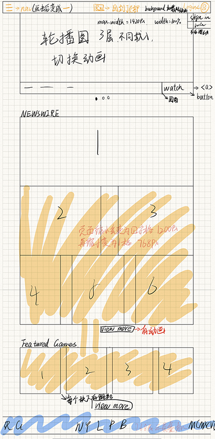

## 学习时间
20:00-23:00

## 学习内容
* 了解R星官网的大致框架
* 学习关于CSS的知识
* 了解响应式布局的内容
* 构建大致框架

## 学习问题
* 将div等无实义的元素转换为语义化的标签，一时半会还没有适应

## 学习计划
* Javascript动态改变width和height
* CSS动画
* 图片懒加载

## 框架

## 学习总结
很久没有做网页才开始还很不习惯，很多简单的布局的知识都忘了，要多做才行XD